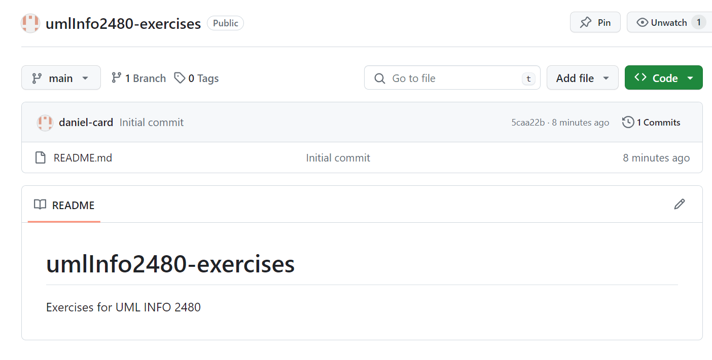
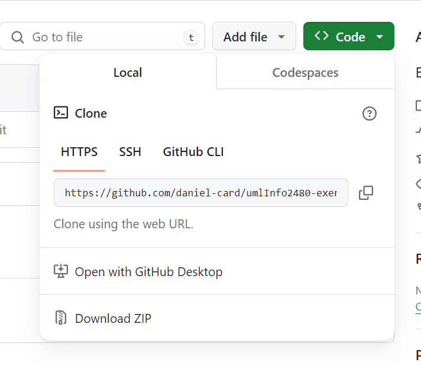
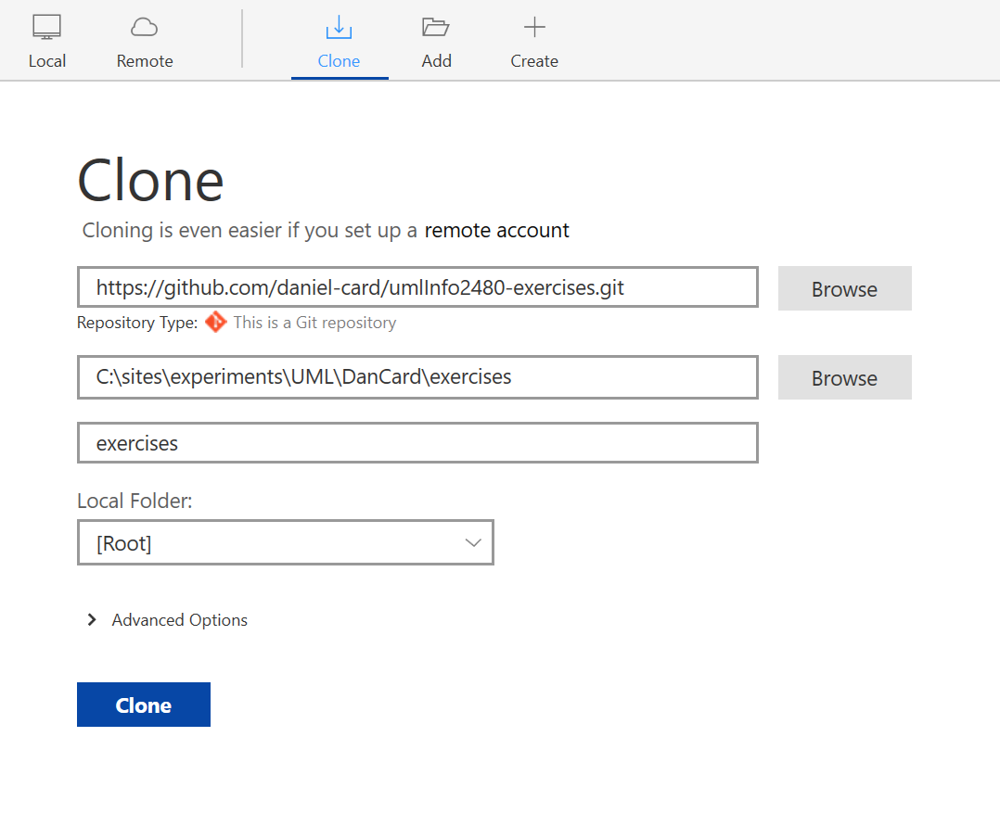

# Cloning a Repo from Github

**Goal: By the end of this document, you’ll be able to clone a repo from** [**Github.com**](http://github.com) **onto your local machine.**

If you find a repo you want to use (or have created on in your own repo and want to start using it), the next step is to CLONE that repo to your local machine. Cloning, just like in biology, is creating an exact copy of the repo in another location. In this case we are going to clone the repo you created for your exercises in the [Git: Creating a Repo on Github](creating-a-repo-on-github.md) onto your local machine.

1. Log into your [Github.com](http://github.com) account.
2.  Go to the home page for the repo you created. You should see the content of the README.md file if you checked the box during the creation process. You should see something like this:\

    <figure><figcaption></figcaption></figure>
3. Open SourceTree.
4. In SourceTree, click on the + sign at the top of the screen then choose Clone from the icon bar
5. Back on Github, click on the green `<> Code` button.
6.  Copy the entire URL under the HTTPS tab. If you click on the 2 squares icon, it will copy the URL to your clipboard.&#x20;

    <figure><figcaption></figcaption></figure>
7. Back in Sourcetree, paste that URL into the top textbox in the Clone screen.
8.  Browse to your `ongoingWork` folder from the [Folder Structure](../../week-1-software/getting-started/folder-structure.md) setup.  **Note: the image is for a demo, the domains and folders be different from yours.**

    <figure><figcaption></figcaption></figure>
9. Click on Clone and the repo will be copied to your local machine.
10. Open the ongoingWork folder in File Explorer or Finder and you’ll see the [README.md](http://readme.md) file and the .git folder (which might be hidden)
