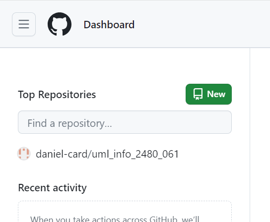

# Creating a Repo on Github

Previously, we looked at creating a git repo on our local machine. We also:

* Created a text file
* Staged and committed that text file to our local repo
* Created a branch off of the master repo
* Made changes. staged and committed those changed into the branch.
* Merged the branch into the master branch to make a new “final product”.

Now, we’re going to create a new repository on [GitHub.com](http://github.com) which is going to house the exercises we are going to do each week. Once it’s created, we’re going to make a copy of it on our local machine in a process called `CLONING`.

1. Log onto your [Github.com](http://github.com) account
2. In the left menu of the Dashboard (the default page when you login) will be a list of your Top Repositories and a green button that says `New`. Click on it. 
3. In the window which appears,

* Give your repository a name ( `umlinfo2480` is given here as an example ).
* Give it a description if you choose
* Keep it public
* Check Add a README file
* You don’t need to add a license if you don’t want to. We can talk about these more in chat, if you want, or you can search for more info on it.&#x20;

<figure><figcaption></figcaption></figure>

Click on Create Repository and you’ll be brought to the home page of your new repo. Congratulations!
