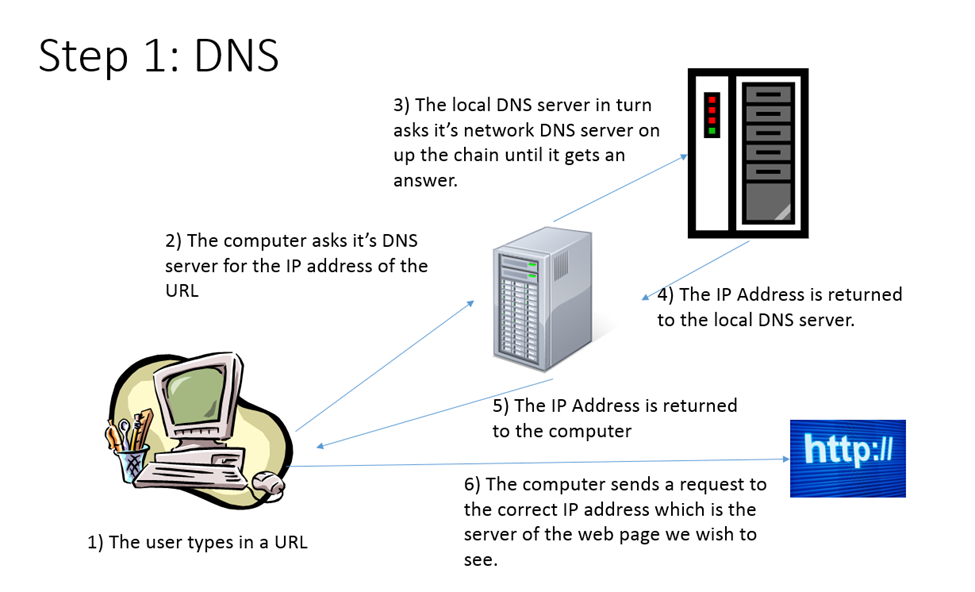

# HTTP Calls and Requests

## Introduction

How does a browser display a web page? Easy, right? You type in an address and the page appears in the window. That’s fine if you are strictly a user. However, as a developer/designer, you need a little more understanding of what’s happening behind the scenes. There are several processes that occur that be roughly be categorized into four steps.

### Step 1: Finding the right server

Web pages are stored on computers (or hosts) attached to a network which is then attached to the Internet. Each of these computers is identified in a number of ways including

1. A MAC address – this is a globally unique number which identifies the network card in the computer. This is essential but unless you are involved in setting up networks and routers, this won’t really impact your day to day too much.
2. IP address – IP stands for Internet Protocol. This is a network address which can only appear once in each network, including the internet. There are two formats of IP. The first is IPv4 which is made up of 4 sets of numbers from 0 to 255 separated by a period. (i.e. 192.168.0.128). The second is IPv6 which is a 128 bit address where the format changes depending on the use. If you “ping” [Google.com](http://google.com), the computer at 173.194.123.6 responds. There is no other computer attached directly to the Internet with that address. HOWEVER, it is possible that other computers in the world have that IP on a different network.

Computers and networks like numbers. Humans like words. We don’t want to remember 173.194.123.6, we find it much easier to remember [Google.com](http://google.com). So how do we bridge that gap between words and addresses? The answer is in a system called DNS or Dynamic Name System. A DNS entry is an authoritative listing that a certain name (i.e. [Google.com](http://google.com) or [stevethewonderdog.net](http://stevethewonderdog.net)) is associated with a certain IP. Each domain name has one authoritative source which is the definitive mapping of a name to an IP. That source can be set by the domain admin and it can be changed. Additional DNS listings can be on a local machine, a local server on your network, or on a server which hosts the DNS entries for millions of computers such as [GoDaddy.com](http://godaddy.com) or other services but these are not the authoritative source, they are simply there to make lookups easier and faster and must routinely check with the authoritative source for the latest information.

When you make a call to a web site, your computer first asks its local DNS server what the IP address for that URL is. If it knows, it returns an IP. If it doesn’t know, that DNS server in turn asks the DNS server one level up what the address it (i.e. your computer might ask your local Comcast network which might ask some other computer on the Internet backbone etc). When it finds the answer, it tells your computer the IP and your computer moves onto the next step.

 <figure><figcaption></figcaption></figure>

### Step 2: The Request

After your browser gets the IP address of the website, it sends a request to the Web Server at that address. Common web servers are the Apache Web Server, Microsoft IIS (Internet Information Server), NginX (pronounced Engine X) which is open source, and Google Web Server. Whatever the web server, it has one job – to find files and return them to the computer which requested them – i.e. to serve files.

This means that it grabs the file and sends it back to the browser. It doesn’t read the file or do any processing to it. The web server can’t do any of the more complicated functions such as talk to databases, send or check email, send data to other servers and web services, create or manipulate images or any of the other functions that we expect modern websites to perform. These functions are performed by different servers which might or might not run on the same host. Remember, even though it is common to refer to “the server” and mean a physical computer, a server is software that is running on the computer. The same host (computer) could have a web server, database server, a server side language server and other servers running on it at any one time as long as it has enough memory, storage and the processor can handle the workload.

If the file has an extension of anything besides .htm or .html, the web server checks its configuration to see if it "knows" another program which can handle that file format. For example, if the file ends in .jsp, the web server hands the file to the jsp engine. If the file ends in .php, it hands it to the PHP server. If the file ends in .cfm, the web server hands the file to the ColdFusion server and so on. This plugin is what does the work of processing the file, accessing the database, doing the math, sending and receiving web services and so on. It then returns the file, fully transformed into HTML, to the web server which in turn sends it back to the user.

 <figure><figcaption></figcaption></figure>

Figure 2: A summary of the response/request process

### Step 3 – The Response

The response consists of the files which are returned to the computer who originally asked for it. There are also special codes which are returned to the requesting machine. One of these is the status code. A code of 200 means that the request was successful. A code of 404 means that the system could not find the file specified. A code of 500 means that the request was valid but due to an internal error, the request cannot be fulfilled. There are many others.

### Step 4: Rendering the Page

The user’s computer just received a file which is written in HTML. However, the user doesn’t want to read the HTML, the users want to view a formatted web page. How do we go from one to the other? The process here is called “rendering”. This process converts the HTML into a document and presents it on the page. There are 3 parts to this:

1. Transforming the text in the HTML document to a hierarchy called the DOM (Document Object Model)
2. Parsing the CSS and stylizing the DOM
3. Parsing and executing the JavaScript which might in turn request its own files from the server.

Each of these steps can be studied more in depthly and understanding how these steps work can help you to create web pages that load faster and render more quickly.

Obviously, this is an overview of the process and each of these steps has several steps underneath it which you can read about or study in other classes. However, this framework is important. It explains why you need to learn at least a little bit of a programming language to work with a database. It explains why you need special software to run pages like .jsp, .php, .asp, .cfm etc files. Another item which it points out is that there is a difference between opening up an .html page which is being given to you from a server and simply choosing “File --> Open” from your browser. The browser can render HTML, CSS and JavaScript but anything more complicated than that needs to be processed by a server first. There are also special security concerns using JavaScript that prevent it from accessing files on your local machine. This is intended to prevent hackers from writing JavaScript that can read or alter the contents on your hard drive when you visit a web page.

Additional Reading&#x20;

Note: These sites were indeed written a while ago as even they will say. However, as a way to get a big picture view of the process, they are excellent. There are more details but the overall information is still valid and relevant.&#x20;

[http://www.html5rocks.com/en/tutorials/internals/howbrowserswork/](http://www.html5rocks.com/en/tutorials/internals/howbrowserswork/)

[http://friendlybit.com/css/rendering-a-web-page-step-by-step/](http://friendlybit.com/css/rendering-a-web-page-step-by-step/)
