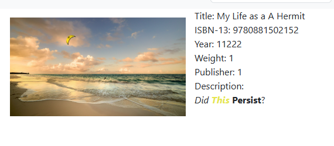

# Connecting to your MySQL database

1. Go to the home page in MySQL Workbench
2.  Click on the plus sign by MySQL Connections&#x20;

    <figure><figcaption></figcaption></figure>
3. Enter UML in the Connection Name
4. Enter uml2480-mysql.cyqisqc1fx3i.us-west-2.rds.amazonaws.com in the Hostname
5. Enter the Username you received for this class in the Username box
6. Click on Store in Vault and enter the password you received
7. Enter your username (first\_last) into the Default Schema box
8. Click on Test Connection and see if you're connection was successfully made. If not, check the settings for accuracy and try again. Note: You must be attached to the Internet but do not need to be on the UML VPN.
9. If you have successfully connected, click on close.&#x20;
10. Click on your connection to open the SQL Editor.
