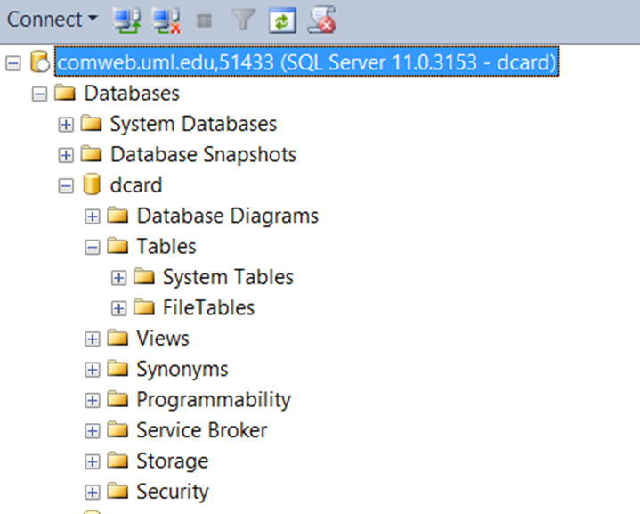
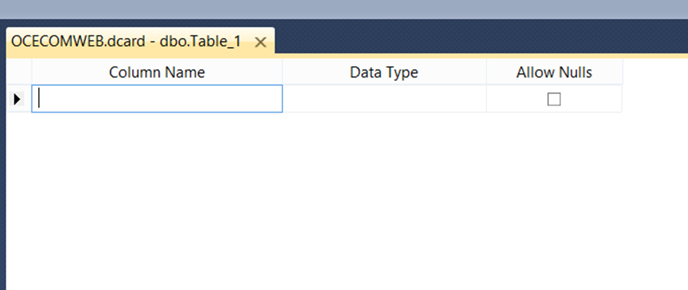
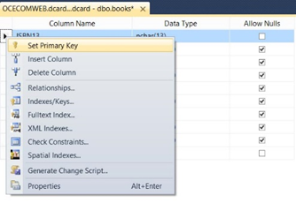
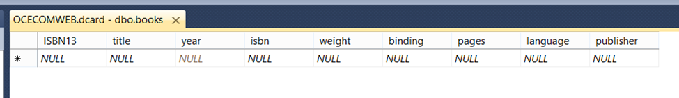

# Introduction To SQL Studio

## Background

We’ve talked before about how a relational database such as Microsoft SQL Server (MSSQL) runs on a special server. To make the server work well there are several interfaces which control its operations. Some are available only to the server or network admins which are responsible for keeping the server running. Others, such as the ones we are looking at today, are for the people who are responsible for the data on the servers. Management Studio is the primary tool that you can use to view, edit and manage the databases in the server. It’s expected that you’ve already gone through the exercises in _Connecting to Class Servers_ in week 1. If you haven’t, go do that now.

## Getting Started

* Open Microsoft SQL Server Management Studio and connect to the [comweb.uml.edu](http://comweb.uml.edu) server.
* In the left hand side of the screen you will see a panel called the Object Explorer (if you don’t see it, click on VIEW à Object Explorer or hit F8)
* Expand the **Database** Node by clicking on the + next to it, if it isn’t open yet.
* Find your Database in the list. It should correspond with your Blackboard Login.
* Expand your Database to see the contents underneath. You should see something like this:

 <figure><figcaption></figcaption></figure>

Figure 1: The Object Explorer in MSSQL Management Studio

* We are going to be working almost exclusively in the folder named TABLES. Be VERY careful about changing anything in the other folders. It is possible to do some real damage to your database if you don’t know what you doing. You should not be able to access anyone else’s database and no one else should be able to access yours except IT administrators and the course instructors.

## What are Tables?

In the 10 books in Excel project, we ended up with an Excel spreadsheet with 4 sheets, each being their own model. When we make the jump to move the project to a database we can look at our data in a very similar, yet slightly different manner.

In a relational database such as MSSQL, MYSQL, Oracle and others, data is stored in tables. At first glance these look similar to the sheets in Excel. When you view them, you will see rows and columns. The columns are called **fields**. The rows are called **records**. Just as in Excel, similar data (such as all the book titles) are stored in the same field as other titles. Each record (row) refers to one book. Beyond that there are many significant differences between Excel and a relational database.

First of all, you can’t hook up an Excel Spreadsheet to a web page. Let me amend that because, yes, technically, you can. However, you would never be able to operate a bookstore like the one we are proposing to run off of an Excel spreadsheet. It isn’t made for it. Databases are designed and optimized to store, retrieve and distribute large amounts of data quickly, accurately and efficiently. Excel is designed to store some data and provide tools to do functions on that data, create graphs, do “what if” scenarios and the like. In short, Excel is an app designed to use and manipulate data while a database is designed to distribute that data quickly on a massive scale.

In Excel, you can type any sort of data you choose into a cell. One minute it can be a string, another it can be a date, and then it can be a number. Excel isn’t locked into any strict data types. In Excel you can right click and choose Format Cells. This will bring up a window which will let you change what the data looks like. Inside the cell is a number or a string or a date but you can still type whatever you want into each cell.

In a database, as you will see in a few minutes, it is possible to set very strict rules as to what types of data get put into the fields and records. This is purposeful in order to protect the integrity of the data underneath it. If a web site with 10 people looking at it a month gets an error because its app was expecting a date and got a string, it’s not the end of the world. However, if bad data gets into the database running the stock market and it crashes, literally the economies of nations get impacted. The data in databases matters. On the one hand it’s 1s and 0s but on the other hand, those 1s and 0s impact the day to day lives of people, even if it’s only their mood if the web site is down.

One of the first parts of creating a database is to create the tables which are going to be used in it.

## Creating Data Tables in MSSQL Server Studio

We are going to create the four tables which we are going to use in the bookstore project. These data models might change as move through the weeks but this is the first pass at creating them. Let’s start with the Books table.

* Right click on the TABLES folder in the Object Explorer window and choose NEW TABLE. You should see a window appear that looks similar to this:

<figure><figcaption></figcaption></figure>

Figure 2: The Create Table window in MSSQL Management Studio

* Type “ISBN13” in the “Column Name” column.
* In the “DATA TYPE” column, click on the drop down arrow. You should have read the article on Data Types before doing this (if not, make sure you read it ASAP). You should recognize many of the data types in that list. There will be some we didn’t cover and we can talk about them later but the ones we need are there. Choose or Type in “**nvarchar(13)**”. This means that this field will be a string field of variable length encoded in Unicode and 13 characters long. (Yeah, if you didn’t read it, might want to).
* In the next line, type in ‘title” and make it a nvarchar(50)
* Make the rest of the fields according to the following class definition:
  1. ISBN13 – nvarchar(13)
  2. title – nvarchar(50)
  3. year – int
  4. isbn – nvarchar(10)
  5. weight – float
  6. binding – nvarchar(40)
  7. pages – int
  8. language – nvarchar(20)
  9. publisher – nvarchar(40)
* Right click in the gray column to the left of ISBN13 field and choose SET PRIMARY KEY.

<figure><figcaption></figcaption></figure>

Figure 2: Setting the Primary Key

* Either type CTRL+S or choose FILE —> SAVE to save the table.
* If you don’t see the books table appear in the Object Explorer, right click on TABLES and choose REFRESH. You should see it now.
* Create the rest of the tables according to the charts below.

Publishers

* publisherID – INT – Primary Key and make this an identity field by going to the column properties under the field names, expanding Identity Specification and changing it to yes.

Figure 3: Choosing the Identity Specification

*
* name – nvarchar(75)
* city – nvarchar(50)
* State – nvarchar(10)
* Country – nvarchar(50)

People

* personid – nvarchar(40)
* title – nvarchar(10)
* firstname – nvarchar(25)
* lastname – nvarchar(30)
* email – nvarchar(50)

Roles

* roleid – nvarchar(40)
* roletitle – nvarchar(25)

persontorole (We haven’t discussed this table yet but go ahead and make it)

* ptrid – nvarchar(40)
* bookid – nvarchar(13)
* personid - nvarchar(40)
* roleid – nvarchar(40)

When you get all of these tables completed, make sure you have saved all of them. Right click on the BOOKS in the Object View and choose EDIT TOP 200 ROWS.

 <figure><figcaption></figcaption></figure>

Figure 3: Editing Rows in MSSQL Studio

You should see this:

MS SQL Studio allows you to enter data directly into the table from here. Populate 2 rows for publishers, roles, people and books table from the data in your Excel Project EXCEPT for the id columns (the publisherid in the publishers table will automatically populate. Do you know why?).

Let me know when you are ready for me to look at your table by completing the assignment in Blackboard telling me to check your tables.
