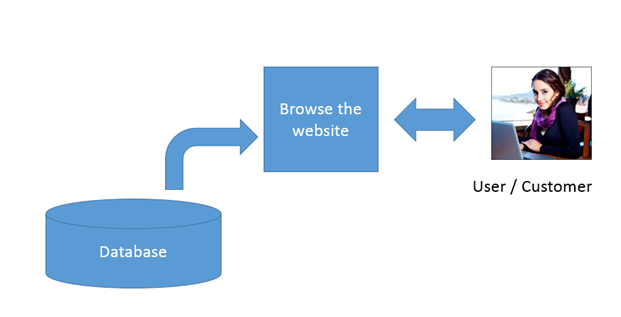
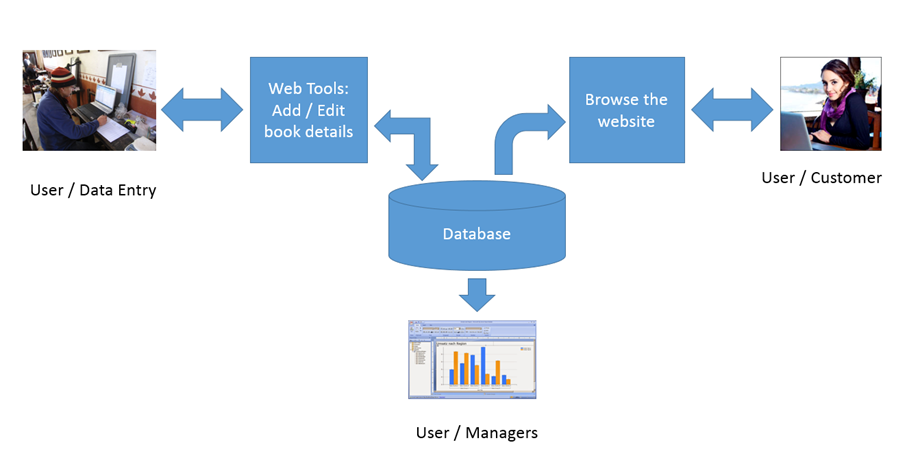

# Our Project And Its Users

Background

So far in the course we have done a refresher on HTML/CSS, we have looked at databases and done a cursory  look at BoxLang. Now we start the process of putting them all together to create our web app. That brings up the question, “What exactly are we trying to create?”

Before we can start coding, it would help to have a picture of what we want to accomplish. To do that we're going to introduce two new topics. The first is called user profiling. The second is called diagramming. Diagramming is drawing…well….a diagram of the website in a way that allows us to visualize parts of our web site and how they relate. For example, at this point, what do we know about our website? We know:

1. There are pages which the customer will use to browse the site
2. Those pages will be linked up to a database
3. The database will store the book data.

If we were going to draw a diagram of this, it would be fairly simple and look like this:

 <figure><figcaption></figcaption></figure>

Figure 1: Quick Sketch of Bookstore’s function and user profiles

Let’s break that down a bit. Databases are typically represented as a cylinder in flowcharts and tech maps. We can see here that we have a database which feeds data to a website. We have a customer who will interact with that website and, evidently, browse it. So far so good but also pretty basic and, to a point self-evident. However, we’re going to build on it. It’s enough to get the general gist of the idea.

Let’s take a look at user profiles.

### User Profiles

At the heart of the user profile is the question: “who exactly is going to be interacting with your application and why?” Throughout the course of your tech career you might have already come across the concept of user profiles and know that it usually involves issues like color, fonts, button placement, language and the “tone” of the site. These are things that make the website easy to use and visually and aesthetically pleasing so people will come to your site, stay and perhaps buy something or do what you want them to do. However, this is looking at a user profile through a marketing lens. This type of user profile is typically focused on identifying potential customers and segmenting them in to demographics to make the message of the website more relatable or entice the user to do something.

However, in IT and in app development, not all of the pages we develop are outward facing. By outward facing, I mean that they are not all geared toward the public. We need to expand our definition of a user profile to not only include people “out there” with whom we want to interact, we have internal clients as well. These are people inside our own organization or inside the clients’ organization. In this case, we aren’t trying to entice people to buy anything, we are trying to help them do their job and do it as easily and as well as possible. We might also be trying to help them perform tasks in ways that heighten security and reduce risk to the organization. People are more inclined to do those things if we make them as easy as possible.

When a user comes to our site, we have a goal for them to perform. This could be to buy a book, sign a petition, subscribe to a newsletter, donate money etc. When we get a user to perform one of these goals, it is called a “conversion”. Just like we have goals for our site, the user has goals of their own. The best situation is when the goals of the user and the goals of the website coincide and both sides can act accordingly. In this case, everybody wins.

“Goal” in this situation is a nebulous term. Everyone has goals which can be stated or not stated. Some of these goals are actions on a web site. Many, if not most are not. For the next few sections we’re going to talk about general goals. When we talk about a goal as it pertains to the web site I’ll call it a _conversion goal_.

### What Are Our Bookstore’s Goals?

You might think that the goal of a bookstore web site is simple and straightforward: sell books, to obtain revenue and stay in business. If you thought this, you would be absolutely correct. Every organization, government, or person, in order to be self sufficient, needs to take in more than they spend. A government needs to spend less or equal to its tax revenue and maybe its borrow limit. Even a non-profit can not spend more than it receives in donations or sales. So, that being said, let’s go one step beyond that and list some auxiliary goals that might exist which support that goal. These might include:

* Lowering the cost of doing business
* Providing a good, safe and pleasant working environment where employees can do their jobs easily and efficiently
* Effectively meeting the expectations of the customer
* Stocking materials the consumer wants
* Increasing the accuracy of the information on the website including a lack of typos and erroneous information
* A web site that works including no broken images or links.

Do these sounds like decent goals? Are all of these goals shared by the same people? Who are the people who have these goals?

I think it is safe to say that the above goals are not all shared by the same people at the same levels.

For example, a **customer** might have a cursory care that the bookstore employee has a safe and pleasant working environment but that’s mostly because she is a caring individual. It’s an abstract goal. Her primary concerns (and rightfully so) are whether the bookstore sells the book she wants, if it is in stock, knowing how much is it, determining how can she pay for it and scheduling (or at least knowing) when will it be delivered. She also cares whether the web site works or not since that is a barrier to getting her book. In addition to having your company lose revenue, a broken or confusing website is frustrating and can impact both your and your visitor’s day greatly.

The **employee** wants a safe and pleasant working environment because a) who wants to dread going to work and b) most people really do want to be good at their job and perform well. This includes having the resources to do their job well, getting paid a fair amount for their work and being able to plan a life with some sort of work/life balance.

The **owner or manager** of the company wants to the company or be profitable, which includes having sales on the website, keeping costs down, keeping the website staff productive and happy and having accurate information about how the website is performing.

The bookstore **technology manager** wants the bookstore to run effectively and quickly, the employees to have the technology tools they need, to not have those tools break, to have the tools be clear and easy to use and to get a paycheck to ensure all of that happens.

But we’re getting ahead of ourselves!!! What are these tools we’re talking about? When you say technology tools, I think of Microsoft Office, hardware, printers, barcode scanners and more. What does that have to do with the website? And what on earth does the bookstore we are creating have to do with keeping costs down or the working environment of the employees?????? This is a technology class, not an MBA program! Why are we discussing this?

I’m glad you asked (even if you didn’t).

### Websites, Databases and Business Process

Databases are all about the storage, analysis and exchange of information. Because of the internet, our technology tools have permeated our society and day to day lives. When we are designing a website, especially a commerce site, we are really designing the way that people, goods, services, and money interact and change hands. At the very least we are impacting how people interact around data.

We have a bookstore and we already knew we want customers to be able to buy a book. But, to start here is to start in the MIDDLE of the story. Before the customer can buy the book from our website’s database, a) the database has to exist and b) the book information has to be entered into the database so it can appear on the website.

Your first thought is probably, “well, duh!” Ok, smarty, how does the data get into the database? So far we’ve looked at using the database GUI to enter fields and enter data. Do we want to give our entire staff access to our database? Probably not. Besides the chance of willful damage either as a joke or malicious sabotage or of accidental damage is very great as well. A broken database would definitely be contrary to the goals of the Technology Director who wants the tech to work, work well, and maximize “uptime” It’s also not in the best interest of the company since a broken database means a non-working website which means our customers aren’t happy because they can’t buy the books they want and the owner isn’t happy because that means less sales. All because we gave access to the database to a non-techie! Oops!

Ok, what if we got the Database Administrator (DBA) who created the database enter all the book titles into the DB. That might make the Tech Director feel better but DBAs are expensive! If we need to, we will, but isn’t there a cheaper way to enter data into the database without hiring a DBA to do that? Yes. Obviously, where we are going with this is to create some web pages so that a “non-techie” can enter and edit data in the database. This way we can control what they can do and can’t do to the DB but still give them just enough access to perform the work they want to do. Everyone is happy, especially the DBA who doesn’t want the tedium of data entry and the non-technical employee who was hired to do the data-entry.

I think we’ve established that we need a bunch of web pages that are facing outward toward the public for shopping and a number of web pages which are facing internally that are used for internal or business operations in running the web site. Let’s bring a little more order into this process.

### Establishing our User Profiles

So far we’ve looked at a couple of things that drive the user profiles. These include

1. The user’s goals
2. The level of access which we want to give the user
3. The level of access needed for the user to achieve their legitimate goals (buying a book is a legitimate goal for a customer. Entering new books into the database is a legitimate goal for an employee. Access to the database to set all book prices to $0.00 is not a legitimate goal for anyone)

So far we’ve identified several users. We’ve also identified several functions that need to happen to sell a book and to make the function work.

Users

* Customer
* Tech Director
* Sales Manager
* Inventory Manager

Functions

* Browse for items
* Enter items into the database
* Edit Items into the database
* Retrieve the number of items sold so they can be ordered or re-ordered for inventory
* Retrieve the number of items and to whom for shipping

Now let’s lay out these users, functions, goals etc in a more organized way

If we update our diagram with this new information we get something like this:

<figure><figcaption></figcaption></figure>

Figure 2: More area added to our diagram of the bookstore website.

This is good enough for a start. We’ll revisit this more later on.

## Conclusion

As we start to build the application which will be our bookstore, we need to have a little more direction about what we need to create. This is essential so what we start to build will be able to fulfil the requirements needed for our project.

Two planning tools that help the planning process are developing User Profiles and Diagramming. We barely scratched the surface on these topics in this document but the concepts are there. User Profiles give us a little more direction about who is going to be using the site. As we get to know more about them and the jobs they need to perform, we can make sure that we create the right tools for them and that those tools are fully developed enough to allow them to do their jobs.

We did just enough diagramming here to get the merest glimpse as to what our simple website needs to contain. There are entire libraries of lists of the types of diagrams that exist for different types of projects. One of the most popular is the **Unified Modeling Language** (called UML – no relation to UMass Lowell). This is a collection of at least 14 different types of diagrams that exist in project management. Some of these are very high level. Others are very very detailed and technical. Some describe databases and others are focused on the behaviors which the users will be carrying out. We are not going to formally get into UML or even scratch the surface. However, the purpose of diagramming is to get your idea across to the people who need to understand it. If that requires a formal UML diagram, fantastic. If it requires a simple sketch on the back of an envelope to one other person, that works as well.
