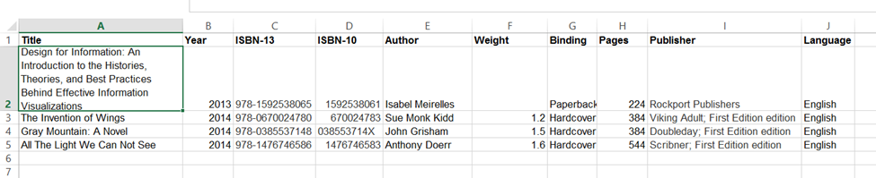

# Introduction To Modelling

## Introduction

So far, we have created

* A data table to store information about articles about our website
* An admin page which allows us to create and edit articles
* A navigation bar which allows the user to choose which article they wish to read
* Code which displays the article information such as the title and body to be read.

This means that we have created a web app. Congratulations! We aren't done with our bookstore but, for all intents and purposes, you have gone through the entire cycle to create working components of an application.&#x20;

We now turn our attention to the "book" part of our bookstore. Just like for the articles, we need to create our data tables first which begs the question of what our tables and fields are going to be

Since data tables can look and feel like a spreadsheet and a spreadsheet allows us to create and edit column titles easily, let's use a spreadsheet to create a mock up of our tables. If we were going to create a spreadsheet containing information about the books in our bookstore it probably look something like this:

<figure><figcaption></figcaption></figure>

Each column has a header which describes the information in that column. Each book has its own row. If you want to find the publication year for “The Invention of Wings”, you look in the Title column for “The Invention of Wings” and then go across to the Year column and see 2014.

Whether you knew it or not, when you were choosing which columns to create, you were performing a process called “modeling”. When referring to a model airplane, you are creating a smaller version of a much larger object, a real plane. It is meant to approximate the real thing without creating another one of the same. A data model is similar except, instead of a smaller version of the object in the real world, it is a conceptual version which focuses on the pertinent information needed for the task at hand. Since most data models exist on paper or in a computer program, we are not creating a replica. Instead, we are trying to describe the object by its properties. A property is something that all objects of a given type, with no or few exceptions, have in common. Properties, in turn have values. In the above example, for the book “The Invention of Wings” the “Year” property has the value of “2014”. There are a few issues which are then raised when talking about this concept of models

* What properties do you choose for your model?
* Can your project have more than one model?
* If everything is a model, how do you tell one object from another (i.e. one book from another)?
* If you have more than one model, do they interact or act alone?

## Choosing Properties for a Model

In modeling a book, there are some very obvious characteristics which nearly all books have in common. These include a title, a publisher (even if it’s self-published SOMEONE had to print it out), a person or group of people who wrote it, a copyright year, the number of pages, the language(s) in which it is written and so on. Each of these properties has a value which, when we start filling them in, describe a particular book. A book model describes an abstract or “ideal” book (as we describe “ideal” to be for our project). When we start filling in the row, we are then describing a particular book. The model describes the ideal and when we populate the row, we move from a hypothetical thing to an “instantiation” of that thing. Plato meet Aristotle.

Who comes up with this model? In real life, that is a case for philosophers and theologians. In our databases or computer programs, you do. The model you create or choose needs to fit the needs of the program or application you are creating. Look at [Amazon.com](http://amazon.com) or any other book-selling website. The information they list about a book is part of their “book” data model.

If you were going to model a person what properties would you list? As a first glance you might include:

* First Name
* Last Name
* Gender
* Age
* Ethnicity

These are general traits that we tend to use to describe people. However, does that model work in all instances? What if you want to send them a personalized message or email? Do you have enough information? You could write Dear <\<First Name>> (as in Dear Steve) but, is that too informal for your company? In that case, perhaps you would write Dear <\<First Name>> <\<Last Name>> (as in Dear Steve Smith). Perhaps that sounds too corporate? Maybe the ideal would be to write “Dear Mr. Smith”. However, to do that we need to amend our data model and add the property “title” or “pronouns”.  Do we need to include an email address? What other characteristics are there? What do we need to include? What do we want to exclude? Are there laws concerning the data we can collect or not?

You might ask why legality might come into this. Consider the scenario where you are creating an application for a scientific research company working on a medical trial. There might be legal issues about a person’s name being directly linked to medical records that are supposed to be confidential or to data that is supposed to be anonymous. Does your data model need to get so specific as to include DNA information which is completely not necessary for a bookstore site? Does that impact the properties of your model? The information you collect and that become part of your model, are directly related to how and where that data is going to be used. This brings up the next question.

## Can You Have More Than One Model?

Absolutely. Typically, a model refers to one thing. However, just like in the real world, models of individual things can interact to create a larger model that reflect, not just one thing, but multiple things that relate to each other.  Let’s revisit the model airplane we mentioned above. Airplanes typically reside at an airport. Can we create a model of an airport? Of course. We can even put our model airplane in the model of the airport. That doesn’t mean that they are the same model. They are separate and distinct things and therefore have separate and distinct models. Make sense?

Wait a minute though! In the example above of the medical company, their model included information about human DNA. That DNA belongs to a person! That person has a first name, just like the bookstore model of a person. Does that mean that if our model is that specific that is has to include all of the more general properties of the thing it belongs to???? That could mean thousands and thousands of properties. What a hassle and what a lot of work!

It’s true that everything could be said to be part of something else. Even our model airplane is made up of smaller pieces. It has wings, a tail, a propeller, landing gears, logos, stickers, paint and all sorts of smaller pieces. In fact, you can go even further and say that the landing gears has smaller pieces as well including the strut, wheel, tire, lug nuts and so on. In turn, the tire has properties including color, size, tread style, tread depth, width and even down to the chemical composition of the rubber. Does your data model need to encompass all of those properties as well?

I hope you realize that the answer is – only if your application needs it. Remember that we aren’t trying to model 100% of reality in our data model, only the properties that are needed for our app. If you are creating a simple app that a hobbyist is going to use to catalog his planes, all you might need is one property called “color” and, if they user can type in “green” and be happy, you’re fine. If you are creating something for a toy manufacturer who needs to know the ins and outs of how the wheels are made, you might need more detail. It all depends on what you are trying to do.

Confused yet? Let’s take a step back and return to our Excel project and our bookstore.

In the above Excel example, we have 10 properties of our book.

* Title
* Year
* ISBN-13
* ISBN
* Author
* Weight
* Binding
* Pages
* Publisher
* Language

Does this encompass all of the information we want about each book? For the moment, let’s say yes. The next question is, “Is there anything on the list that could be its own separate model or be broken down into smaller pieces?” Let’s take them one by one.

* Title: Technically a title could be broken down into each word but does that get us anywhere? Not really. Let’s leave this as is.
* Year: This is pretty straightforward and is pretty basic. Let’s leave this one as is as well.
* ISBN / ISBN-13: The ISBN and ISBN-13 numbers are a globally unique way of identifying books and publications. There is a reason why there are two of them which we can discuss in a different forum. These numbers can be broken down into smaller pieces that represent the publisher and other information but all we’re doing here is using it to identify a book so we don’t need to do that. Let’s leave it as it is.
* Author: An author is a person and we’ve already shown that some properties of people can be modeled. Do we want to do so here? How do a book and an author relate? First off, an author can write several books. For that matter, a book can be written by several authors. If each of two items can relate to many of the other items, they are working very autonomously from each other and might be good candidates to have their own models. Not only that but we might want to access more information about the Author like a first name, last name, a personal website, a fan club web site, a title such as Mr. or Ms. or other bits of information. Given these criteria, the author is a good candidate to have its own model.
* Weight: This is a number signifying its mass. Let’s leave this one as it is.
* Binding: Potential values for this include Hardcover, Paperback, eBook. These are all values, not properties about a type of binding so we can leave it as it is.
* Publisher: What do we know about publishers? They can publish many books, not just one. A publisher might have many properties of its own including a name, address (which can then be broken down into streets, city, state, zip codes, country etc), a chief editor, phone number, web site, etc. That is a lot of properties. This is probably another good candidate to be its own model.
* Language: We’re not writing a treatise on linguistics, we simply want to list the language in which this book is written. We can probably leave this alone as well.

Looking back over this list, we now see that we have three models:

* Book
* Authors
* Publisher

Not a bad start. So far is this making sense? Let’s go one step further. What is an author? For the most part, writers are people. Maybe we should have a “person” object! Do people appear other places in this situation? People write books. People edit books. People work at publishing houses. There are people everywhere. However, let’s keep thinking about that and look at one of the books from my Excel example above. Does the following tell a complete story – _Gray Mountain: A Novel_….John Grisham.  We have a title which from this context we can assume is a book and we have a name. But what does John Grisham have to do with _Gray Mountain: A Novel_? Did he write it? Did he edit it? Did he star in the movie? Did he find it on the street? What ties the book (Gray Mountain: A Novel) to the person (John Grisham)? It’s the role he plays in its creation. In other words, the person (John Grisham) is the book’s (Gray Mountain: A Novel) author. We seem to be missing another potential model which we could call the “Role”. A **role** consists of a **person** doing something for a **book**. Potential values of that role could be Author, Editor, Publishing Agent, Publicist, Character (in the story), Proofreader etc.

This leaves us with 4 models as part of our larger picture:

* Book
* Person
* Role
* Publishing Company (I slightly adapted this to make it clearer)

Ok, we have four models at this point: Book, Person, Role, and Publishing Company. Let’s put each of them on their own Excel Page. Like this:

<figure><figcaption></figcaption></figure>

Figure 1: Books

<figure><figcaption></figcaption></figure>

Figure 2: Publishing Companies

<figure><figcaption></figcaption></figure>

Figure 3: People

<figure><figcaption></figcaption></figure>

Figure 4: Roles

How are you doing? Confused? It’s a pretty abstract concept and I can see you wondering how we got here from a 3-line table in Excel. If you’re struggling, keep reading. It will all come together, promise!

## Identifying Models and Rows

Does this look like a step backward? At least before we knew which book had which publisher and which author. Now we have all that information spread out over four different Excel sheets and nothing that ties any of it together? Why did we go through this exercise?

Stay tuned. Almost done. How do we tie the different sheets together? First let’s look at the sheets one at a time.

On the books page, is there a way to identify each row uniquely? Meaning, that if I want to find a particular book, I know that if I search for THIS, I will find that book and ONLY that book. Obviously, it isn’t the binding since there are literally millions of books which are in paperback. Ditto for the year, page numbers, weight and language. They aren’t unique. That leaves us with the title and the ISBN. Interestingly enough, many books are published with the same titles as other books which, if you think about it, makes sense after the length of time that there have been books in print (for more reading on this topic, purely as a tangent: [http://flavorwire.com/376237/the-doubles-10-pairs-of-great-books-with-the-same-titles/](http://flavorwire.com/376237/the-doubles-10-pairs-of-great-books-with-the-same-titles/)). That leaves us with the ISBN and ISBN-13 as a unique identifier for a publication. This makes sense since that is exactly why they were designed in the first place.&#x20;

With the rise of computers and, more specifically, bar codes, it became important to have a quick way of tracking publishing and inventory data. This initiative was led by the British Bookseller WHSmith back in the mid-1960s. If you want to identify an exact book publication, including what binding and edition it is, look for it by the ISBN. The ISBN-13 is the same number with 978 put in front of it. For trivia purposes, this is to make the ISBN barcodes work within the larger barcode system of UPC or Universal Product Code. Everything has a barcode these days and they are tracked by their UPCs. The first three digits of a UPC code refer to a country. The 978 in an ISBN-13 signifies that this UPC is part of “bookland” and the rest of the numbers refer to an ISBN.

On the publisher’s page, is there a way to identify each publisher uniquely? Is there an ISBN equivalent for publishers? Kind of but it’s fairly confusing and, for now, not important so we’re going to punt on using a pre-defined identifier like an ISBN. What’s important is that we have a way to identify a certain row uniquely IN OUR DATABASE and we can do that by simply adding a column to our sheet. We can call it anything but, conventionally, it’s called something like “ID”. We don’t need to get fancy. All we need to do it put something in it that is unique. Using integers which ascend in order seems to make sense. When we get more advanced in our thinking, we might decide that ascending integers aren’t actually the best identifier although they are used very often. For now, however, they suit our purposes.

Now our Excel Sheet looks like this:

<figure><figcaption></figcaption></figure>

Figure 5: Publishers with the new ID column

AH! Why add a new column? Couldn’t we just go by the line number on the left of the screen? They pretty much match anyway. Well, not really. What if we want to browse through the publishers and sort them alphabetically? The row numbers would stay in order but the order of the books would change.  Fortunately, the ID row would sort as well so we can still use them to find each row uniquely.&#x20;

When there is a column that is used to make each row unique, like the ISBN or the ID, we call that the “Primary Key”. It is the thing that makes each row in the set completely unique which means we can go to the last section for this reading. Primary Keys can be made up of one or more columns.

## Relating Sheets and Objects to Each Other

So where does that get us? We now have a way to connect the two sheets. We take the primary key from the publisher sheet and put it in the corresponding row in the book sheet. Like this:

<figure><figcaption></figcaption></figure>

Figure 7: Books with the corresponding Publisher key populated

Now, these two sheets have a relationship and we’ve establish how these two models relate to each other. When the value of a primary key from one sheet is in another table, it is then called the “foreign key”.

Why is this better? Two Reasons.

### Reason 1: Less Typing and Smaller File Sizes

If we included the fields for the publisher in the same table as the book, we would add 6 more fields. This is for each book that publisher has in its inventory. Since there have been approximately 158,464,880 books which have been published in the world as of 2023 ( [https://isbndb.com/blog/how-many-books-are-in-the-world](https://isbndb.com/blog/how-many-books-are-in-the-world) ), this means we could end up with nearly a billion additional pieces of information, all of which would be duplicated.

&#x20;What a hassle! Besides the hassle (and time and effort and potentially carpel tunnel syndrome inducing labor), there is also the issue that the size of the file is also going to get quite large very quickly. What a waste, especially when all of that data is unnecessary when we can just type a number into 1 column and be done with it. Much easier and, ultimately, just as effective. What if the publisher changes phone number or address? If we have two models, we change it in 1 place and 1 place only. By trying to cram everything into one model, we would have to type the new address for each book we have in our database. Ugh!

### Reason 2: Much Easier to Change our Data Model Later

Rarely do models stay the same forever after they are created. The needs of the app change, organizations change, and new features get added. Basically, ya know, life. So what happens if we keep going with everything on the same line and then decide we need to add a column like a website? We add the column and then we have thousands or millions of rows with a blank column on the end of it that we need to populate. Again, what a great deal of work.

Much easier to have two models and be done with it.

## A Note about Relationships

It’s possible to talk about the kind of relationship that two data models have by referring to how many of them are involved or potentially involved. There are three types: one to one; one to many (and conversely many to one) and many to many. Here are some examples:

* Each book (and by this I mean an edition) is published by one and only one publisher. This is a one to one relationship
* A publisher can publish many different books this is a one to many relationship.
* A person can have multiple roles on a book and a book can have multiple people in the same role (i.e. two authors or multiple editors). This is a many to many relationship.

## Communicating About Models

At the beginning of this document we talked about an ideal something and a tangible thing. When we have defined all of the properties we are going to use in our model we have actually defined a **class**. When we actually assign values to those properties it is called **instantiating** and the result is an **object**. Therefore, an object is a specific instantiation of a class. The use of the word class might be confusing since we’ve already ran across the world “class” as being used as a property of an HTML element and only relating to the style that is defined in the CSS area of the page. However, the context in which the word is being used should indicate which one is being used.

To help in communication, we can draw classes using a Class Diagram. This is part of a set of diagrams which are collectively called UML (Universal Modeling Language) diagrams.&#x20;

## Conclusion

We’ve come a long way from the beginning of this reading. Confused? It can be a confusing topic. If it helps, go through it again and actually make the Excel files as you go through it. Here is the quick summary of the last 10 pages.

1. Models are a conceptual replica of something.
2. Models have Properties and Values
3. These properties can be as detailed or general as the application needs them to be.
4. To reflect these properties and values we can put them onto a spreadsheet in columns and rows. Each column is one property and each row reflects one of that type of model (i.e. there is a title column and each book has its own row)
5. Each row needs to have a property to uniquely identify it from all of the other rows in the sheet. This property is called the Primary Key
6. The primary key can’t be just the row number because we need to be able to rearrange and sort the rows and the unique value needs to sort with it.
7. We can relate multiple sheets together by using these primary keys.
8. When the primary key from one sheet is in another sheet, it is called the “foreign key”.
9. When two or more sheets are linked together view primary and remote keys, the sheets are said to be in a relationship.
10. Relationships can be categorized as one to one, one to many or many to many.
11. An ideal definition of something is a class and, when it is instantiated, it becomes an object.
12. Classes can be drawn to better communicate your design choice using the UML Class diagram.
