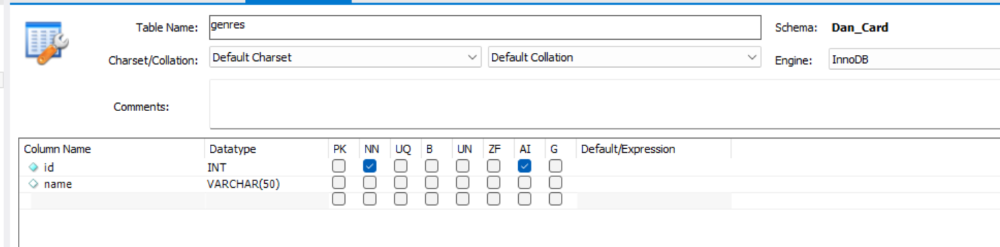

# Displaying Our Publisher

In previous exercises, we added a select control to our Manage Books page (addEdit.bxm). However, we haven't completed the process of displaying the publisher on the search resutls page on the front of our website (details.bxm).&#x20;

The details.bxm template is populated by a query from bookstore.common.books in the searchBooks() function. Currently, that query is returning everything from out books table including the publisherId. We can add that to our display but all we are going to see is the actual Id of the publisher like this:

```boxlang
<bx:output> 
    <image src="/bookstore/common/images/#bookinfo.image[1]#" style="width:300px;float:left; margin:15px"/>
    <div>Title: #bookinfo.title[1]#</div> 
    <div>ISBN-13: #bookinfo.ISBN13[1]#</div> 
    <div>Year: #bookinfo.year[1]#</div> 
    <div>Weight: #bookinfo.weight[1]#</div>
    <div>Publisher: #bookinfo.publisherId[1]#</div>
    <div>Description: #bookinfo.description[1]#</div> 
</bx:output>
```

<figure><figcaption><p>The rendered code in oneresults.bxm</p></figcaption></figure>

That doesn't help us very much since no-one know what Publisher "1" is. W
